Main Menu
---------

On launching the application, the user is greeted with a series of options for:
LZ77 operations, grammar operations and our Signature store data structure.
Figure 1 presents the menu.

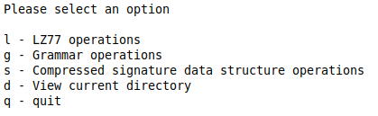

Figure 1: Program main menu.

LZ77 Operations
---------------

On input ‘l’, the user is given a series of options related to LZ77 operations.
Figure 2 displays the menu.

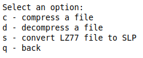

Figure 2: LZ77 operations menu.

### Compression

On input ‘c’, the user is required to enter a text file to be compressed. Once
the software completes the compression phase, the user will see the outputted
LZ77 compressed tuples. In addition, an output file named
original_file_name.lz77 will be saved to the working directory; the output file
is then available to be decompressed. Figure 31 shows a file, exampleInput.txt,
containing the string “abaababaabaab” being compressed into a set of seven
tuples, shown in Figure 4.

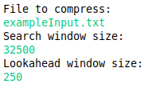

The example compression outputs the file *exampleInput.txt.lz77* into the user’s
directory.

### Decompression

On input ‘d’, the user is required to enter a .lz77 compressed file and a
desired output file name. Once the software completes the decompression phase,
the user will have the desired output file in their working directory containing
the original message contained by the original .lz77 compressed file. Figure 5
shows our previous *.lz77* file, exampleInput.txt.lz77, being decompressed into
its original message in *exampleOutputFile.txt*.

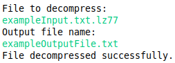

### LZ77 to SLP

On input ‘s’, the user is again required to enter a *.lz77* file and a desired
output file name. Once the software completes the conversion, the user will have
a set of productions printed to the desired output file in the working directory
which defines the balanced SLP representation of the LZ77 compressed file. In
addition, the program will display the parse tree of the balanced SLP. Figure 6
shows our previous *exampleInput.txt.lz77* file being converted into a balanced
SLP, with productions printed to

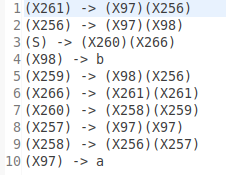

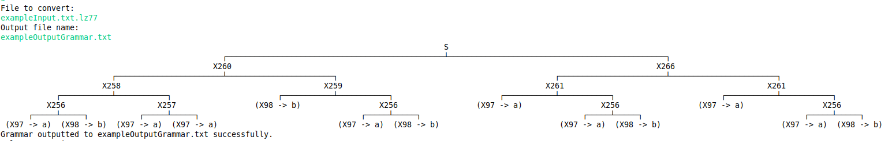

*exampleOutputGrammar.txt*, shown by Figure 7.

Grammar Operations
------------------

###  Parsing a grammar

On input “g”, the user is immediately required to enter a text files containing
a set of productions defining an SLP in Chomsky Normal Form, Once the program
has completed the parsing phase (i.e. a correctly defined grammar in Chomsky
Normal Form including a start symbol (S)) the user’s grammar will be
successfully loaded into the program and can run the available operations.
Figure 8 shows our input file, *exampleGrammar.txt*, being successfully parsed
and loaded into the program.

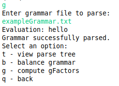

Figure 8: Grammar parsing example input with options menu.

### Viewing parse tree

On input “t” after successfully loading a grammar file, the user can view the
parse tree of the loaded grammar. Figure 9 displays the parse tree of the loaded
grammar from *exampleGrammar.txt*.

### [./media/image9.png](./media/image9.png)

Balance an inputted grammar

On input “b” after successfully loading a grammar file, the user is required to
enter a desired output file for the newly balanced grammar. After a grammar is
successfully balanced, the user will have a set of productions printed to the
desired output file in the working directory which defines a newly balanced
grammar which produces the same word as the original grammar; the newly balanced
grammar is then loaded into the program and is given the same menu options.
Figure 10 to Figure 12 shows our original grammar, from *exampleGrammar.txt*,
being balanced successfully and outputted to *exampleBalancedGrammar.txt*.

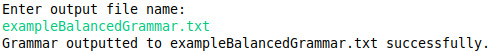

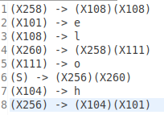

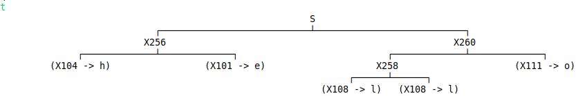

### Compute G-factors

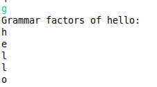

On input “g” after successfully loading a grammar file, the user can view a list
of the G-factors of the inputted grammar. Figure 13 displays the G-factors for
*exampleGrammar.txt*.

Signature Data Structure Operations
-----------------------------------

On input “s”, the user is given a series of options asking whether they want to:
create a new signature store, load an existing signature store, save the current
signature store or view the signature store’s available operations. Figure 14
gives the initial menu, and Figure 15 gives the menu on user input “o”.

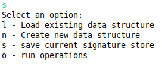

Figure 14: Signature store menu.

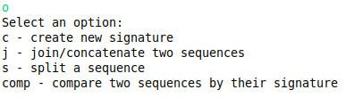

Figure 15: Signature store operations menu.

### Creating a New Signature

On input “c” of the operations menu, the user is required to enter a sequence
they wish to compress to a signature. Once the program has successfully
compressed the sequence, the program displays a parse tree of signatures
representing the original sequence, as well as the unique signature which
defines that sequence; the sequence as well as its signature is stored into the
current signature store. Figure 16 shows the program creating a signature for
the sequence *“testing”*.

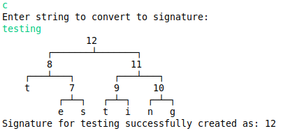

Figure 16: signature created for the sequence "testing".

### Concatenating sequences

On input “j” of the operations menu, the user is required to enter two sequences
they wish to concatenate. The program will attempt to create a signature for
both sequences, returning an existing signature if one exists for that sequence.
Once the program has successfully concatenated the sequence, the program
displays a parse tree of each original sequence, followed by the parse tree of
the newly concatenated sequence, as well as the unique signature which defines
that sequence; the sequence as well as its signature is stored into the current
signature store. Figure 17 shows the concatenation of sequence *“test”* and
*“ing”*, resulting in the same signature as Figure 16.

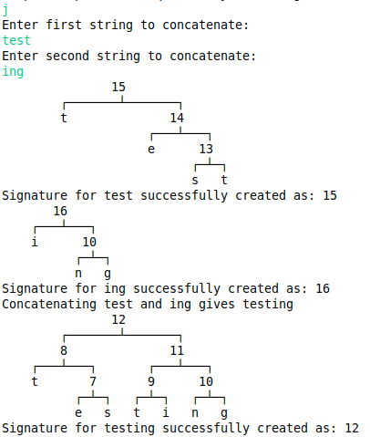

Figure 17: concatenating sequences "test" and "ing", resulting in the same
signature as previously.

### Splitting a sequence

On input “s” of the operations menu, the user is required to enter a sequence as
well as an integral position, $$i$$, they wish to split the sequence at. The
program will attempt to create a signature for both sequences (split at position
$$i$$), returning an existing signature if one exists for each sequence. Once
the program has successfully split the sequence, the program displays a parse
tree for the original sequence and each sequence (split at position $$i$$). Both
newly created sequences are then stored in the signature store. Figure 18 shows
the splitting of sequence *“testing”* at position 4, resulting in the same
signatures for sequences *“test”* and *“ing”* as created previously.

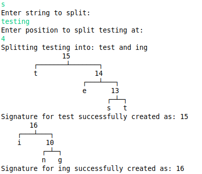

Figure 18: splitting the sequence "testing" at position 4, resulting in the same
signatures as previously created.

### Equality Checking

On input “comp” of the operations menu, the user is required to enter two
sequences they wish to compare under the current signature store. The program
will attempt to create a signature for both sequences, returning an existing
signature if one exists for each sequence. Once the program has successfully
obtained a signature value for each sequence, the program displays a parse tree
for both sequences and a simple equality comparison is conducted between both
integral values to confirm whether they are equal. Figure 19 and Figure 20 show
two comparisons of equal and differing sequences respectively.

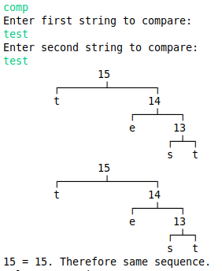

Figure 19: comparing identical sequences.

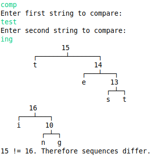

Figure 20: comparing different sequences.

#### Saving a Store For Later Use.

On input “s” of the original signature store menu, the user is required to enter
a desired output file name. The current signature store is then saved in the
desired output file. The output file can be reloaded on input “l” and the
desired input file; the loaded signature store will contain all previously
created signatures. Figure 21-Figure 23 shows the saving and reloading of the
created signature store, showing that previously created signatures are not
lost.

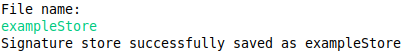

Figure 21: saving the current signature store in exampleStore file.

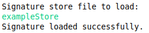

Figure 22: reloading exampleStore from working directory.

Figure 23: operations produce same signatures as previously created.
